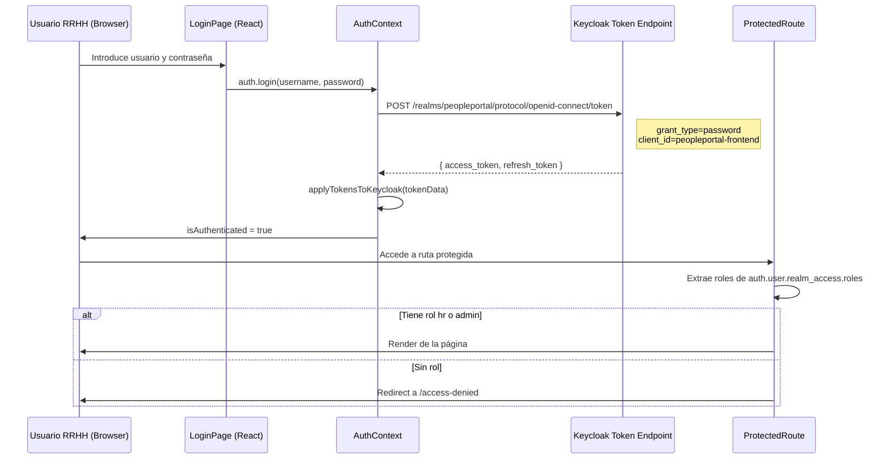

# Autenticación — FrontEnd RRHH

## Mecanismo: ROPC directo a Keycloak + verificación de roles

El panel RRHH utiliza un formulario de login propio (React) con el flujo **Resource Owner Password Credentials (ROPC)**. Los roles se verifican desde el JWT parseado, no mediante `useKeycloak()`.



---

## Configuración `keycloak.js`

`keycloak.js` crea un objeto `Keycloak` como **proxy de token** para el interceptor Axios. **No se llama a `keycloak.init()`** — los tokens se inyectan manualmente desde `AuthContext`.

```js
// src/keycloak.js
import Keycloak from 'keycloak-js';

const keycloak = new Keycloak({
  url:      import.meta.env.VITE_KEYCLOAK_URL || 'http://localhost:30080',
  realm:    'peopleportal',
  clientId: 'peopleportal-frontend',
});

export default keycloak;
```

---

## ProtectedRoute (`components/ProtectedRoute.jsx`)

```jsx
import { useAuth } from '../context/AuthContext';
import { Navigate } from 'react-router-dom';

const ALLOWED_ROLES = ['hr', 'admin'];

export default function ProtectedRoute({ children }) {
  const { isAuthenticated, loading, user } = useAuth();

  if (loading) return <CircularProgress />;
  if (!isAuthenticated) return <Navigate to="/login" replace />;

  const roles = user?.realm_access?.roles ?? [];
  const hasAccess = ALLOWED_ROLES.some(r => roles.includes(r));

  if (!hasAccess) return <Navigate to="/access-denied" replace />;
  return children;
}
```

---

## Pantalla AccessDenied

Mostrada cuando el usuario autenticado no tiene los roles `hr` o `admin`.

---

## Interceptor Axios

```js
client.interceptors.request.use((config) => {
  if (keycloak.token) config.headers.Authorization = `Bearer ${keycloak.token}`;
  return config;
});
```

---

## Almacenamiento del token

| Item | Valor |
|---|---|
| Clave access_token | `pp-rrhh-token` (sessionStorage) |
| Clave refresh_token | `pp-rrhh-refresh` (sessionStorage) |
| Scope | Session (se limpia al cerrar pestaña) |
| Refresh automático | `AuthContext` refresca antes de que expire |

---

## Realm y client de Keycloak

| Parámetro | Valor |
|---|---|
| Realm | `peopleportal` |
| Client ID | `peopleportal-frontend` |
| Client type | Public (sin secret) |
| Grant type | **Resource Owner Password Credentials (ROPC)** |
| Roles requeridos | `hr` o `admin` |

```js
import Keycloak from 'keycloak-js';

const keycloak = new Keycloak({
  url:      import.meta.env.VITE_KEYCLOAK_URL || 'http://localhost:8080',
  realm:    'peopleportal',
  clientId: 'peopleportal-frontend',
});

export default keycloak;
```

---

## ProtectedRoute (`components/ProtectedRoute.jsx`)

```jsx
import { useKeycloak } from '@react-keycloak/web';
import { Navigate } from 'react-router-dom';

const ALLOWED_ROLES = ['hr', 'admin'];

export default function ProtectedRoute({ children }) {
  const { keycloak, initialized } = useKeycloak();

  if (!initialized) return <CircularProgress />;

  if (!keycloak.authenticated) {
    keycloak.login();
    return null;
  }

  const roles = keycloak.tokenParsed?.realm_access?.roles ?? [];
  const hasAccess = ALLOWED_ROLES.some(r => roles.includes(r));

  if (!hasAccess) return <Navigate to="/access-denied" replace />;

  return children;
}
```

---

## Pantalla AccessDenied

Mostrada cuando el usuario autenticado no tiene los roles `hr` o `admin`.

Contenido:
- Mensaje explicativo del error de acceso
- Link al Portal Colaborador (`http://localhost:30081`)
- Botón para cerrar sesión (`keycloak.logout()`)

---

## Interceptor Axios

```js
client.interceptors.request.use((config) => {
  const token = keycloak.token;
  if (token) config.headers.Authorization = `Bearer ${token}`;
  return config;
});
```

---

## Realm y client de Keycloak

| Parámetro | Valor |
|---|---|
| Realm | `peopleportal` |
| Client ID | `peopleportal-frontend` |
| Client type | Public (sin secret) |
| Grant type | Authorization Code + PKCE S256 |
| Roles requeridos | `hr` o `admin` |
