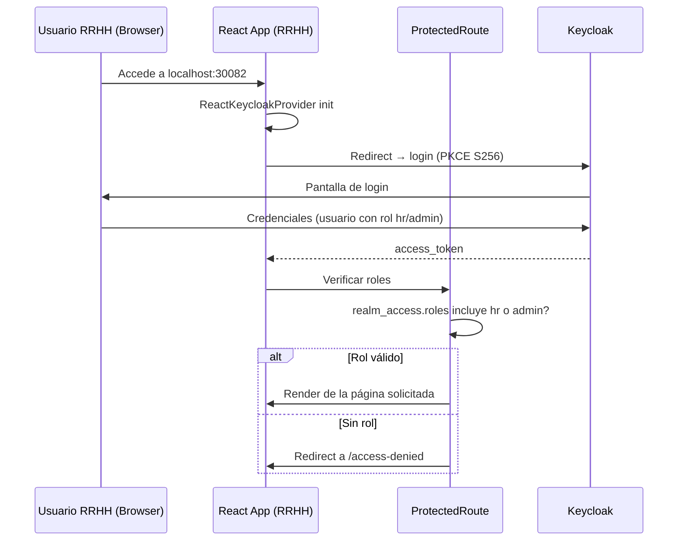

# Autenticación — FrontEnd RRHH

## Flujo Keycloak PKCE S256



---

## Configuración Keycloak (`keycloak.js`)

```js
import Keycloak from 'keycloak-js';

const keycloak = new Keycloak({
  url:      import.meta.env.VITE_KEYCLOAK_URL || 'http://localhost:8080',
  realm:    'peopleportal',
  clientId: 'peopleportal-frontend',
});

export default keycloak;
```

---

## ProtectedRoute (`components/ProtectedRoute.jsx`)

```jsx
import { useKeycloak } from '@react-keycloak/web';
import { Navigate } from 'react-router-dom';

const ALLOWED_ROLES = ['hr', 'admin'];

export default function ProtectedRoute({ children }) {
  const { keycloak, initialized } = useKeycloak();

  if (!initialized) return <CircularProgress />;

  if (!keycloak.authenticated) {
    keycloak.login();
    return null;
  }

  const roles = keycloak.tokenParsed?.realm_access?.roles ?? [];
  const hasAccess = ALLOWED_ROLES.some(r => roles.includes(r));

  if (!hasAccess) return <Navigate to="/access-denied" replace />;

  return children;
}
```

---

## Pantalla AccessDenied

Mostrada cuando el usuario autenticado no tiene los roles `hr` o `admin`.

Contenido:
- Mensaje explicativo del error de acceso
- Link al Portal Colaborador (`http://localhost:30081`)
- Botón para cerrar sesión (`keycloak.logout()`)

---

## Interceptor Axios

```js
client.interceptors.request.use((config) => {
  const token = keycloak.token;
  if (token) config.headers.Authorization = `Bearer ${token}`;
  return config;
});
```

---

## Realm y client de Keycloak

| Parámetro | Valor |
|---|---|
| Realm | `peopleportal` |
| Client ID | `peopleportal-frontend` |
| Client type | Public (sin secret) |
| Grant type | Authorization Code + PKCE S256 |
| Roles requeridos | `hr` o `admin` |
